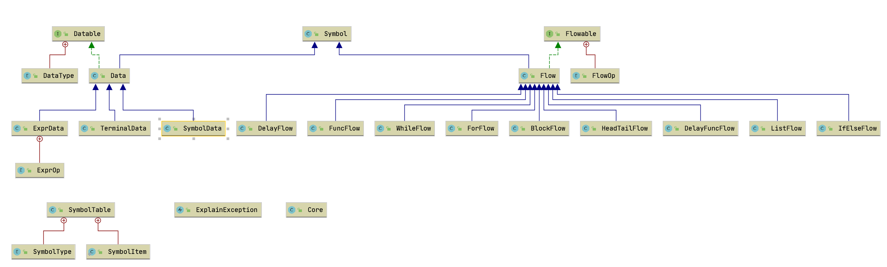

# Fldw

The Fldw language, means the flowing of data, a stream program language with the pattern matching.

Fldw，寓意数据的流动，是一个支持模式匹配的流式编程语言。

其为动态类型，支持语句块和符号定义域，支持指针和值传递，支持函数的递归调用。

基于 Java 15，其为 LL(3) 语法。

---

# 快速上手

## Windows

## MacOS or Linux

## Docker

https://www.cnblogs.com/lsgxeva/p/8746644.html

```shell script
docker run -it adoptopenjdk/openjdk15 /bin/bash 
apt-get update
apt-get install git
git clone https://github.com/lilinxi/Fldw.git
exit

docker commit -a "imortal" -m "fldw v0.0.5" 1283cfcf9bff fldw:v0.0.5
docker images fldw:v0.0.5
docker tag 00e5da98e693 imortal/fldw:v0.0.5
docker push imortal/fldw:v0.0.5 

docker pull imortal/fldw:v0.0.5
docker run -it --rm imortal/fldw:v0.0.5 /bin/bash
```

---

# 语言特性

本语言的设计思想源于 Streem，Elixir 和 Lua 等高级编程语言。

## Streem

Streem 语言创立自 Ruby 之父松本行弘，其在《日经Linux》杂志上的连载，介绍了新语言Streem 的设计与实现过程，并将连载整个成书《松本行弘：编程语言的设计与实现》。

Streem 的源代码已开源在 [GitHub](https://github.com/matz/streem)

Streem 是基于流的并发脚本语言。它基于类似于shell的编程模型，并受Ruby，Erlang和其他功能编程语言的影响。

Streem 类似shell管道的编程模型深受笔者的喜爱，例如，使用 Streem 实现的 cat 程序为：

```shell script
stdin | stdout
```

在 Streem 中，管道操作符`|`为主要的操作符，Fldw 语言借鉴了其编程模型的思想，使用了基于流的编程语言，并使用`|`为主要的操作符。

使用 Fldw 实现的 cat 程序为：

```shell script
import std.std
stdin | stdout
```

使用 Fldw 实现的`hello world`程序为：

```shell script
import std.std
["Hello World!"] | stdout
```

## Elixir

Elixir 被设计为应对并发编程的高级编程语言，但是其拥有众多良好的编程特性值得借鉴。

Elixir 可以看做 Ruby 基本块，Lisp 宏和 Erlang actor 并发模型的结合，

Elixir 语言支持模式匹配和 for 推导，通过这两个特性，可以使得使用 Elixir 实现的快速排序符合直觉且易于理解。

例如，Elixir 实现的快速排序如下：

```shell script
defmodule QuickSort do
  def sort([]), do: []
  def sort([head|tail]), do:
    sort(for(x<-tail, x<=head, do: x)) ++
    [head] ++
    sort(for(x<-tail, x>head, do: x))
  end
end

IO.inspect QuickSort.sort([5, 6, 3, 2, 7, 8])
```

Fldw 语言借鉴了其模式匹配的实现和 for 推导的思想，实现了类似的语法，使用 Fldw 语言实现的快速排序如下：

```shell script
import std.Std

function sort() {
    in | [!head;!tail]
    if ( head != null ) { 
        [] | !leftHead
        [] | !rightHead
        for ( tail -> !tmp) {
            if ( tmp < head ) {
                #[tmp] | leftHead
            } 
            else {
                #[tmp] | rightHead
            }
        }
        leftHead | sort() | out
        [head] | out
        rightHead | sort() | out
    } | out
}

stdin | sort() | stdout
```

## Lua

Lua 被设计易于内嵌和迁移的配置语言。其灵活的函数参数和返回值使得 Lua 脚本作为配置脚本十分易用。

- **灵活的参数**：传参太少，未传入的参数作为 nil；传参太多，多余的参数会被忽略；也可以设置可变参数的函数。
- **灵活的返回值**：函数的返回值可以有多个，可以选择使用所有的返回值，或者忽略部分。

Fldw 借鉴了 Lua 灵活的传参思想。例如，其实现的灵活赋值操作为：

```shell script
import std.Std
[5, 6, 3, 2, 7, 8] -> [a, b, c, d] -> [e, f, g, h, i, j] | stdout
```

其输出为：

```shell script
5
6
3
2
null
null
```

Fldw 实现的灵活的函数传参实例为：

```shell script
import std.Std
function func([a, b, c]) {
  [a, b, c] | stdout
}
func([1, 2])
func([1, 2, 3, 4])
func()
```

其输出为：

```shell script
1
2
null
1
2
3
null
null
null
```

---

# 语法详述

## 基础语句

### 流基础

在 Fldw 中，流为基础的数据单元，可以被赋值，执行，作为函数的参数和返回值。

流由一系列的数据组成，数据类型支持整数，浮点数，布尔值和字符串。

如何使用一个流：

```shell script
[1, 2, 3, 4]                 // 流可由 [] 括起来的数据组成
[1, 2, 3, 4] | symbol        // 流可赋值为一个符号
[1, 1.23, true, "hello"]     // 流可包括四种基础类型
[1 2 3 4]                    // 流中的逗号可以省略
1 2 3 4                      // 在作为标准输入时，流的 [] 也可以省略
```

### 流执行语句

Fldw 中的可执行语句主要有三种，赋值，管道，匹配。

#### 赋值

赋值操作可以将一个流赋值到一个符号上，例如：

```shell script
[1, 2, 3, 4] | symbol
```

赋值操作当然可以嵌套：

```shell script
[1, 2, 3, 4] | symbol | symbol1 | symbol2
```

这下 symbol，symbol1 和 symbol2 都被赋值到了相同的值

由于是动态语言，没有显示的符号声明和定义语句，若想要创建一个空的数据流，可以使用以下代码：

```shell script
[] | symbol
```

symbol 符号的使用默认会递归查找当前符号表和父符号表，若希望显示地定义局部变量，需要使用`!`显示表示：

```shell script
[] | !symbol
```

#### 管道

管道操作符为`|`，可以使用管道操作将一个流的数据导入另一个流。

例如，导入到标准输出流：

```shell script
import std.Std
[5, 6, 3, 2, 7, 8] | stdout
```

导入到另一个数据流：

```shell script
import std.Std
[5, 6, 3, 2, 7, 8] | [a, b, c, d] | stdout
```

其输出为：

```shell script
5
6
3
2
7
8
null
null
null
null
```

Fldw 的模式匹配也是通过管道来实现的，不过管道的另一端连接的是一个`HeadTail`流：

```shell script
import std.Std
[5, 6, 3, 2, 7, 8] | [head;tail]
tail | stdout
[head] | stdout
```

其输出为：

```shell script
6
3
2
7
8
5
```

在此模式匹配操作中，head 为一个数据，即为传参的首位数据，tail 为一个流，即为传参的剩余数据组成的流。

#### 匹配

匹配操作符为`->`，可以实现两个流中数据的匹配。

例如在上例中：

```shell script
import std.Std
[5, 6, 3, 2, 7, 8] | [a, b, c, d] | stdout
```

其表示为两个流的拼接，若使用匹配操作符`->`，则为：

```shell script
import std.Std
[5, 6, 3, 2, 7, 8] -> [a, b, c, d] | stdout
```

其输出为：

```shell script
5
6
3
2
```

其表示为第一个流的前四个值被赋值到了第二个流的四个变量中，多余的两个参数被忽略。

其灵活的匹配操作可以自由的丢弃多余的参数，或者保持变量为未赋值的状态，例如：

```shell script
import std.Std
[5, 6, 3, 2, 7, 8] -> [a, b, c, d] -> [e, f, g, h, i, j] | stdout
```

其输出为：

```shell script
5
6
3
2
null
null
```

其中第二个流`[a, b, c, d]`被第一个流的前四个值复制，而之后将其值复制到第三个流`[e, f, g, h, i, j]`的前四个值，并保持后两个值为`null`。

## 导入包语句

Fldw 语言支持扩展包的导入，使用插件机制。目前只包含标准输入包和标准输出包`std.Std`

```shell script
["hello world"] | stdout
```

在这里没有任何输出，stdout 被解析为一个符号流，因为标准输入输出包并未加载。下面加载标准输入输出包：

```shell script
import std.Std
["hello world"] | stdout
```

此时输出为：`hello world`

> stdin 不能在交互模式中使用，因为交互模式中标准输入被占用，只能在脚本文件中使用。可以参考`cat_example.sh`

## 表达式语句

Fldw 中目前支持 +，-，*，/，% 等算数运算，<，>，<=，>= 等比较运算，和 &&，||，!=，== 等逻辑运算。

其中针对解析出的表达式，不会进行类型的判断和求值的操作，而在使用到表达式的值的时候，再进行运算符和运算值的类型匹配和求值操作。

在运算中，int 和 double 的运算会被强转为 double 和 double 的运算，例如：

```shell script
import std.Std
[1+2 2.2+3.3 true||false 2<3] | stdout
```

其输出为：

```shell script
3
5.5
true
true
```


## 块语句

Fldw 中的块为一系列可执行流语句的集合。例如：

```shell script
import std.Std
{
  ["hello"] | stdout
  [1, 2, 3] | stdout
  [true, false] | stdout
  [1.1 2.2 3.3] | stdout
}
```

其输出为：

```shell script
"hello"
1
2
3
true
false
1.1
2.2
3.3
```

在一个块中，所有的语句都会等待块语句解析完成后再执行。

另外，一个块语句也可以作为一个单独的流被调用，其中输入和输出通过`in`和`out`来指定，例如：

```shell script
import std.Std
[1, 2, 3, 4] | sym | {
  in -> [a, b, c] | out
} | stdout
```

其输出为：

```shell script
1
2
3
```

> 因为交互模式是按行输入的，所以暂时不支持换行的 block 输入，如需在交互模式中使用 block，请将 block 写作一行使用。

## 控制语句

Fldw 中支持的控制语句包括，if-else，while 和 for，其中 for 为遍历一个数据流。其实例为：

## 函数语句

---

# 词法详解

---

# 语法详解

---

# 指称语义详解

## 抽象语义

```
Command ::= Skip
     | "[" Data, Data "]"                           //Q
     | SYMBOL
     | SYMBOL ( Actual_Parameter_Sequence )
     | if_expr
     | while ( Data ) { Command } 
     | for (Data ) { Command }
     | Command < MATCHING > Command
     | Command < FLOWING > Command
     | Command Command              //Q

if_expr = 

Data ::= INT_VALUE
     | DOUBLE_VALUE
              | BOOL_VALUE
     | NULL_VALUE
     | STRING_VALUE
     | SYMBOL
     | ! SYMBOL
     | SYMBOL ( Actual_Parameter_Sequence )
        | ( Expression )
        | [ Expression more_Expression* ]                //流数据
        | # [ Expression more_Expression* ]              //取值
        | Expression && Expression
        | Expression || Expression
        | Expression * Expression
        | Expression / Expression
        | Expression + Expression
        | Expression - Expression
        | % Expression
        | Expression < Expression
        | Expression >Expression
        | Expression <= Expression
        | Expression >= Expression
        | Expression == Expression
        | Expression != Expression

moreData ::= , moreData
Declaration ::= import SYMBOL . SYMBOL
      | function SYMBOL ( Formal_Parameter_Sequence ) { Command }
Formal_Parameter_Sequence ::= Formal_Parameter
        | Formal_Parameter , Formal_Parameter_Sequence
Formal_Parameter ::= SYMBOL        //Q:有几种形参类型
Actual_Parameter_Sequence ::= Actual_Parameter
        | Actual_Parameter , Actual_Parameter_Sequence
Actual_Parameter ::= SYMBOL           //Q
```
## 语义域

### 错误

### 真值域

### 数字域

### 字符串域
```
integer        N
double        D
boolean           B = { true, false }
null        L
string        S
symbol        M 
flow        F 
function       C
value        V = N + D + B + L + S + M + F + C
type        T = { integer , double , boolean , null , string , 
            symbol , flow , function } 
store           St
environ        En
```
### 说明
symbol类型
```
```
flow类型
```
```
store类型
```
```
environ类型
```
```
## 语义函数

```shell script
execute [ F1 -> F2 ] env sto = 
    let val = evaluate car(F1) env sto in
    let variable loc = find(env, car(F2)) in
    update(sto, loc, val)
    if !empty(cdr[F1]) && !empty(cdr[F2]) = boolean true
    then execute [ cdr[F1] -> cdr[F2] ]

execute [ F1 | F2 ] env sto = 
    let val = evaluate car(F1) env sto in
    cons(val, F2)
    if !empty(cdr[F1]) = boolean true
    then execute [ cdr[F1] | F2 ]
```

## 辅助函数

```shell script
empty: list -> boolean
update: env X env—stack X id X value -> env
cons: value X list -> list // 合并元素和列表
car: list -> value  // 获取列表的第一个元素
cdr: list -> list // 获取列表除去第一个元素的列表
```

---

# 设计思路

总代码量：

```shell script
(base) limengfan@limengfandeMacBook-Pro javacc % git log --author="lilinxi" --pretty=tformat: --numstat | awk '{ add += $1; subs += $2; loc += $1 - $2 } END { printf "added lines: %s, removed lines: %s, total lines: %s\n", add, subs, loc }' -
added lines: 19484, removed lines: 10123, total lines: 9361
```

## 基础模型设计

Fldw 核心包，core 包的类图如下图所示：



由类图可得，Fldw 语言中最重要的两个类型分别为 Data 和 Flow，其分别实现了 Datable 接口和 Flowable 接口，意为数据类和数据流类。而 Data 和 Flow 均继承自 Symbol 类，Symbol 包含了变量的指针，在 Fldw 中，不论是束定到符号的变量，还是未束定到符号的临时变量，均有指针，但是未束定的变量无法在语言编码中进行寻址。

在设计和实现中，均采用了**接口，默认实现加特殊实现**的模式。通过默认实现 Data 和 Flow，可以设定接口的默认实现，和未实现的报错，这样针对特殊实现，只需要继承自默认实现即可，不需要在针对接口的每一个方法去一一实现。

Datable 中的部分关键接口如下：

```java
public interface Datable {
    DataType GetType() throws ExplainException;                     // 获取类型

    Object GetValue() throws ExplainException;                      // 获取值

    String GetSymbol() throws ExplainException;                     // 获取符号

    boolean SetType(DataType type) throws ExplainException;         // 设置类型，返回是否设置成功

    boolean SetValue(Object value) throws ExplainException;         // 设置值，返回是否设置成功，需要先设置类型再设置值

    Datable Clone() throws ExplainException;                        // 拷贝数据，深拷贝
}
```

其中，Datable 接口共有三个特殊实现，分别为：

1. TerminalData：终结符数据，其值即为字面量当量，无法被赋值。
2. SymbolData：符号变量，将数据关联到符号，可以在符号表中寻址，可以被重复赋值。
3. ExprData：由 Datable 组成的表达式树，使用懒求值，在其值被使用的时候，在动态地进行类型的推定和求值。

Flowable 中的部分关键接口如下：

```java
public interface Flowable {
    boolean Push(Flowable flow) throws ExplainException;                // 流入一个流，返回是否成功

    boolean Match(Flowable flow) throws ExplainException;               // 将当前流的值模式匹配到参数流

    int inLen() throws ExplainException;                                // 当前流输入长度

    int outLen() throws ExplainException;                               // 当前流输出长度

    void SetNextFlowing(Flowable flow) throws ExplainException;         // 设置下一个流

    Flowable NextFlowing() throws ExplainException;                     // 返回下一个流

    boolean HasNextFlowing() throws ExplainException;                   // 是否有下一个流

    boolean Flowing() throws ExplainException;                          // 解释执行：开始元素的流动
}
```

而 Flowable 接口共有九个特殊实现，分别为：

1. ListFlow：最基础的数据流类，一个包含数据列表的数据流。
2. BlockFlow：若干个数据流的集合，另外包含一个专门接受输入的流，和专门进行输出的流。
3. DelayFlow：封装了一个 Flowable，用来对流的执行进行懒加载，来延迟流的执行。
4. HeadTailFlow：封装了一个数据和一个数据流，用来执行首位数据和剩余数据流的模式匹配。
5. IfElseFlow：封装了两个流，if-流和 else-流（可选），根据条件变量的真假值来判断执行哪一个流。
6. WhileFlow：循环执行所封装的流，直到条件变量的真假值为假。
7. ForFlow：对数据流的每个数据，执行所封装的流。
8. FuncFlow：封装了一个 BlockFlow 和一个参数流，并束定了一个符号作为一个函数流。
9. DelayFuncFlow：封装了一个函数流，延迟了函数流的执行，用来实现动态的函数递归调用。

另外，在核心包 Core 包中，还包含了：

1. 符号表的实现（后面介绍）
2. 异常类的实现
3. Core 类：用来进行 Core 包的加载

## 表达式树设计

Datable 接口和表达式树类的设计，使得数据运算树的建立的求值十分的直观。

Datable 中关键的两个接口为：

```java
public interface Datable {
    DataType GetType() throws ExplainException;                     // 获取类型

    Object GetValue() throws ExplainException;                      // 获取值
}
```

在 ExprData 中，伪代码可为：

```java
public class ExprData extends Data {
    private Datable leftData;       // 运算左值
    private Datable rightData;      // 运算右值
    private ExprOp op;              // 运算符
    private DataType type;          // 表达式的类型

    @Override
    public DataType GetType() throws ExplainException {
        if (this.type == null) {
            this.type = ExprData.CheckExprTypeMatch(this.leftData.GetType(), this.rightData.GetType(), this.op);
        }
        return this.type;
    }

    @Override
    public Object GetValue() throws ExplainException {
        switch (this.op) {
            return Solve(this.leftData.GetValue(), this.rightData.GetValue(), this.op);
        }
    }
}
```

其巧妙之处在于 ExprData 的左孩子和右孩子的 Datable 接口的实现均可为 ExprData，由此得到的 ExprData 的 GetType() 方法和 GetValue() 方法其实是一个递归的类型推断和求值的过程，由此实现了表达式树的建立和懒求值。

## 包模块设计

Fldw 中支持包的导入和加载，目前仅实现了 Std 包，包含标准输入和标准输出。

包的加载语句为`import packname.modulename`，其通过 Java 的反射机制，调用被加载包的`Load()`方法来进行动态的包加载。

例如，加载包的语句为：

```java
Class<?> clazz = Class.forName(package_name + "." + module_name);
Method loadModule = clazz.getMethod(Core.ModuleLoadFunc);
loadModule.invoke(null);
```

Std 包的加载语句为：

```java
    //    默认调用 Load 方法将标准包的流导入到当前符号表中
    public static void Load() throws ExplainException {
        SymbolTable.CurrentSymbolTable().UpdateSymbol(StdInFlowSymbol, SymbolTable.SymbolType.Flow, new StdInFlow());
        SymbolTable.CurrentSymbolTable().UpdateSymbol(StdOutFlowSymbol, SymbolTable.SymbolType.Flow, new StdOutFlow());
    }
```

即 Std 包的加载，其实质就是在当前符号表栈的栈顶符号表中添加了两个符号流，stdin 和 stdout。

## 语句块设计

语句块，即 BlockFlow 是 Fldw 设计和实现和核心，其他控制流，例如 if-else-flow，while-flow，for-flow 和函数流 func-flow，都是通过 BlockFlow 来实现的。

BlockFlow 即封装了一系列的 Flowable 列表，也实现了 Flowable 接口，即 BlockFlow 本身也可以看做一个数据流来进行处理。

当 BlockFlow 被看做一个数据流来处理时，其输入被导入到默认的输入流`in`中，输出从默认的输出流`out`中读取。

BlockFlow 的部分实现如下：

```java
public class BlockFlow extends Flow {
    private Flowable inFlow;                // 输入流
    private Flowable outFlow;               // 输出流
    private ArrayList<Flowable> flowList;   // 中间处理流

    @Override
    public boolean Push(Datable data) throws ExplainException {
        return this.inFlow.Push(data);
    }

    @Override
    public Datable Pop() throws ExplainException {
        return this.outFlow.Pop();
    }

    @Override
    public boolean Flowing() throws ExplainException {
        for (Flowable flow : this.flowList) {
            boolean success = flow.Flowing();
            if (!success) throw new ExplainException("Flowing Error: " + flow);
        }
        return true;
    }
}
```

## 符号表和符号表栈设计

Fldw 使用符号表来存储变量，符号表中可以存储的变量类型为：数据、数据流、函数和子符号表。

通过符号表在存储符号表的机制，实现了命名空间的嵌套和子命名空间。并使用符号表栈来维护所有的符号表之间的关系。

当前所使用的符号表，即为符号表栈的栈顶符号表。而每进入到一个语句块，即建立子符号表并且压栈，之后新定义的符号都在子符号表中，在离开语句块时将当前符号表出栈。

通过维护一个符号表和字符表的关系，并且对符号表的查找递归查找到所有的父符号表，可以实现语句块外部定义的变量在语句块内部可见，而在语句块内部定义的变量在语句块外部不可见。

## 函数设计

Fldw 中的函数，其本质是一个束定到一个符号的 BlockFlow，其可以通过束定的符号来进行查找个调用，而 BlockFlow 即是一个匿名的函数，只能被调用一次。

并且 FuncFlow 还支持动态传递参数。

在符号表中，函数的束定符号和其语句块被存储在符号表中，为了支持函数的递归调用，不能对函数进行立即的解释并建立语法树（不是不可以立即执行，而是立即解释也不可以），所以需要使用 DelayFuncFlow 来进行函数的延迟解释和执行，即当且仅当对函数执行前才进行解释和建立语法树，由此实现了函数的递归调用。

---

# 研发理念

1. 使用**接口+默认实现+特殊实现**的研发模式，新增加的特殊实现继承自默认实现即实现了所有的功能，新增加的功能可以后续逐渐添加。
2. 使用**插件模式进行动态的加载**，新增加的扩展包可以动态的被加载和导入。
3. 遍布全文的**异常处理机制**，所有的程序运行异常都可以被捕获并抛出，并附有异常信息，可以便于编程人员进行调试。
4. **单元测试和集成测试**相辅相成，每一个功能点都新增单元测试，并增加到集成测试中，通过调用集成测试进行回归测试，可以及时发现新增功能是否引入了影响已有功能的 Bug。
5. **版本控制和打包部署**，使用 GitHub 进行团队的协作和版本的控制，使用 Maven 可以对依赖项进行便捷的打包（Ant 老了），通过 jar 包和 Docker 镜像两种部署模式，提高了用户的运行体验。

---

# 感悟体会

1. 良好的编程习惯不应是自上而下的，也不应是自下而上的，而应是端到端的快速迭代。

- 自上而下：快排实例
- 自下而上：Datable 和 Flowable 接口

2. 在敲第一行代码之前，先动脑子和动笔。